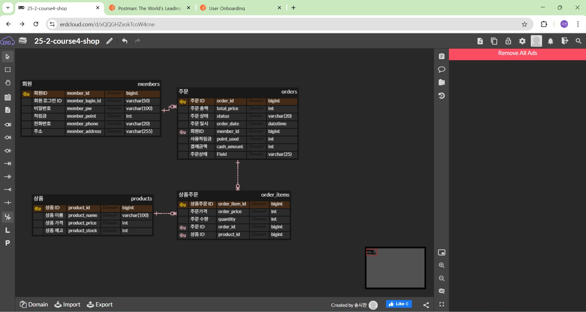
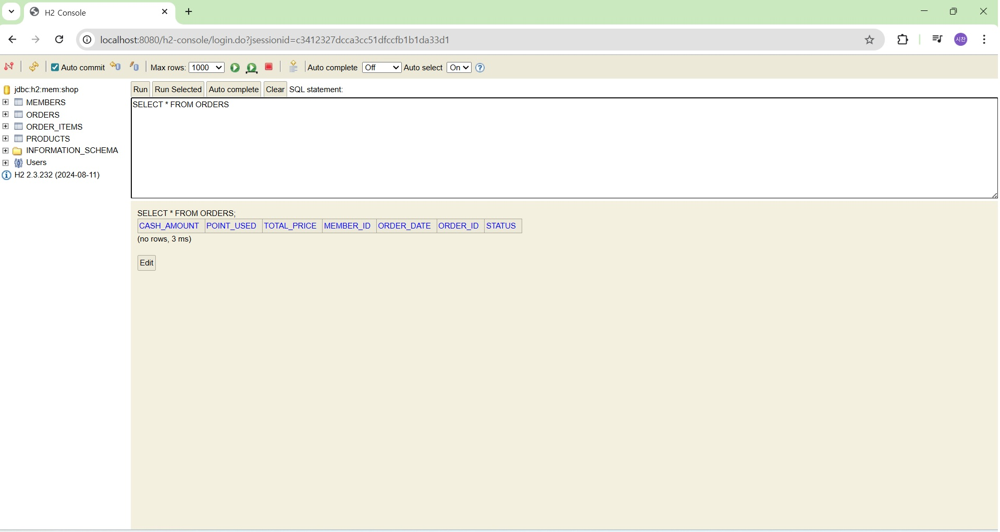
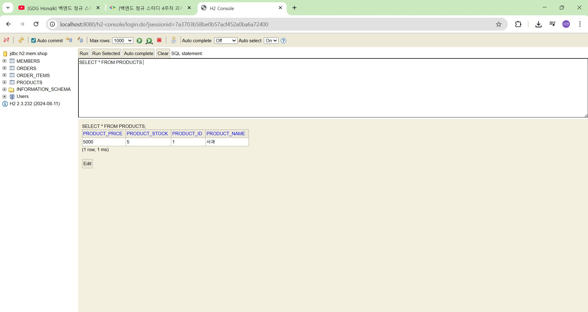
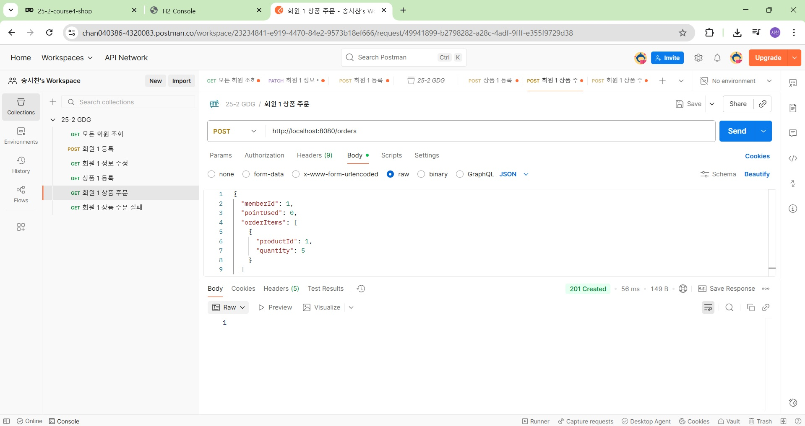
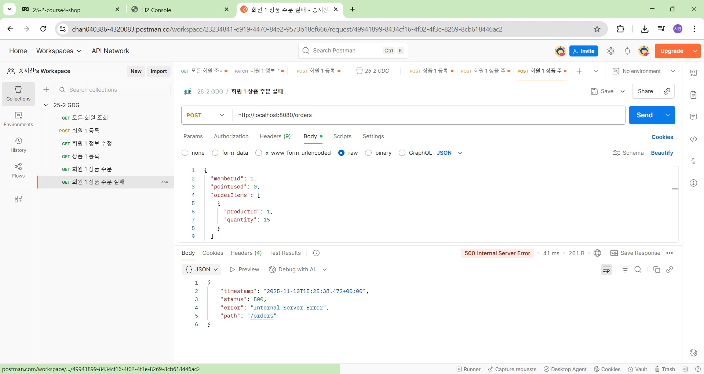

# 4주차 학습내용

  ## 1. DB 설계

    ### ERD

        데이터 청사진

        개체(Entity)와 관계(Relationship)를 중심으로 모델링하는 기법을 시각화한 것

    ### 핵심 용어

       + 개체(Entity): 관리해야 할 데이터의 주체(ex: 회원, 상품, 주문)
       
       + 속성(Attribute): 개체가 가지는 구체적 정보(ex: 아이디, 이름)

       + 기본 키(Primary Key, PK): 데이터를 고유하게 식별하는 속성

       + 외래 키(Foreign Key, FK): 다른 테이블의 PK를 참조하여 테이블 간의 연결을 돕는 속성

       + 관계: 개체 사이의 연관성, 일대다(1:N), 다대다(N:M) 등
    

  ## 2. 일대일과 다대다

    ### 일대다 (1:N)
    
     + 1명의 회원이 여러 개의 주문 내역을 가진다면 member : order = 1 : N

     + Order테이블은 member_id를 FK로 가짐

    ### 다대다 (N:M)

     + 주문 한 건에 여러 개의 상품 포함, 상품 하나가 여러 건의 주문에 포함 등의 상황

     + 중간 테이블(연결 엔티티)를 도입하여 구현

  ## 3. 적용하기

    ### 엔티티 클래스 작성
    
     + @Id, @GeneratedValue 어노테이션으로 PK 자동 생성, 

     + @Column 으로 컬럼명 지정, @Table로 테이블명 지정

    ### 외래 키 구현

     + @ManyToOne 과 @JoinColumn 어노테이션으로 구현

     + LAZY, 지연로딩으로 Order 객체 정보를 가져올때 연결된 Member 객체 정보를 필요할때만 가져오도록 할 수 있음

  ## 4. 스크린샷

    ### DB ERD
    
     

    ### h2 table

     

     
      
    ### postman

      

      

