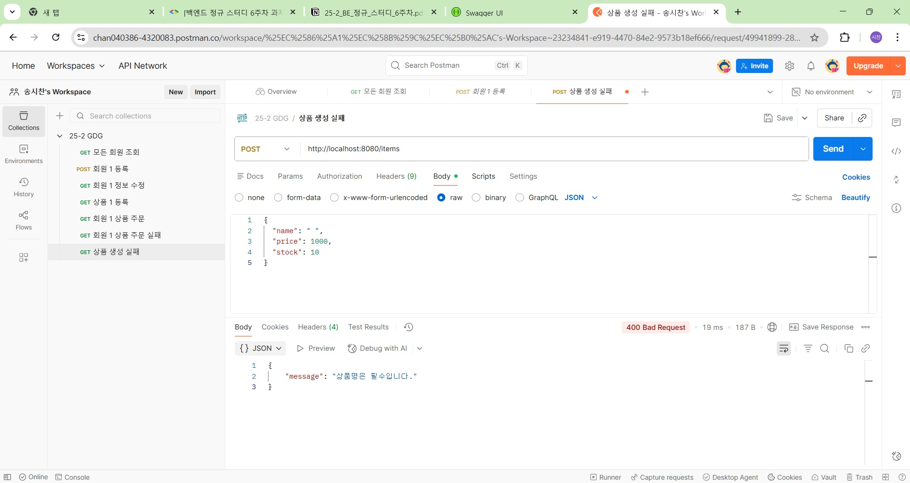
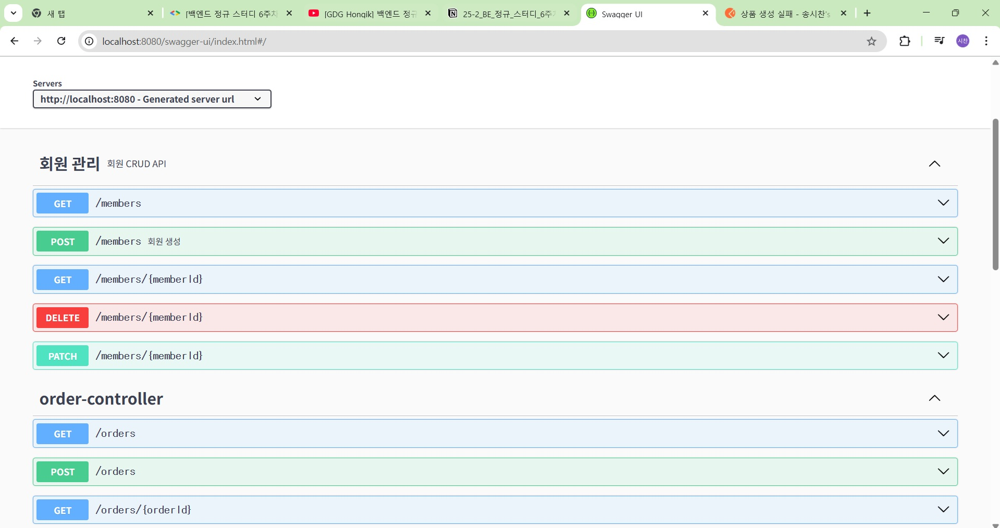

# 6주차 학습내용

  ## 1. 유효성 검사

    ### 유효성 검사

        클라이언트의 잘못된 요청에 대해 서버 내부 오류인 500 에러를 반환하는 것은 클라이언트에게 혼란 초래

        클라이언트의 잘못된 요청은 4로 시작하는 상태 코드로 응답

    ### 구현

       스프링은 DTO에 @NotNull(Null이 아닌지), @Size(크기 범위 검사), @Pattern(형식 검사) 등의 어노테이션을 적용하여

       유효성을 검사하고 컨트롤러의 메서드 인자에 @Valid 추가
    

  ## 2. 리팩토링

    ### 리팩토링

        엔티티가 비즈니스 로직이 하는 NULL 체크 등을 담는 것을 분리하고 서비스 계층에서 NULL 판단 및 데이터 갱신 로직을 처리하도록 수정

        엔티티는 도메인 모델로서의 책임만 갖고, 서비스는 비즈니스 로직을 담당하여 단일 책임 원칙 준수
    

  ## 3. 예외 처리 

    ### 글로벌 Exception 핸들러
    
     + @ControllerAdvice와 @ExceptionHandler를 사용하여 애플리케이션 전역에서 발생하는 예외를 중앙에서 처리

     + 관점 지향 프로그래밍으로 여러 클래스에 걸쳐 반복되는 공통 기능 분리

    ### 커스텀 예외 클래스

     + RuntimeException을 상속받아 BadRequestException, NotFoundException 등의 커스텀 예외를 생성하고,

       이를 글로벌 핸들러에 등록하여 명확한 에러 응답 반환

    ### 예외 메시지 클래스

     + 중복 사용되는 예외 메시지 문자열을 별도의 클래스에 상수로 정의하여 유지보수성 및 가독성을 높임

  ## 4. 스크린샷

    ### 400 Error postman 스크린샷
    
     

    ### Swagger UI 스크린샷

     

      
